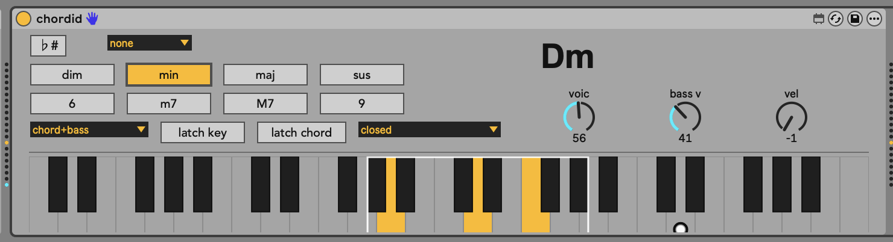

# chordid

**chordid** is a Max for Live MIDI Effect that turns a single MIDI note into a voiced chord. The root note you play determines the chord; the chord-type buttons (dim / min / maj / sus, plus 6 / m7 / M7 / 9) shape it; the voicing dial slides the inversions up and down the keyboard; the bass output plays the root separately so you can split it onto a sub.

It's a port of [BespokeSynth's `chordkeyboard`](https://github.com/BespokeSynth/BespokeSynth/pull/2058) module (itself inspired by the Telepathic Instruments Orchid hardware).



## Example

Hold **min + m7** active, play C3. chordid outputs:

- chord (MIDI ch 1): Eb3, G3, Bb3 (the m7 voicing folded into the octave starting at voicing=41)
- bass (MIDI ch 2): C3

Change to **maj + maj7 + 9**, still on C3: E3, G3, B3, D4 on ch 1; C3 on ch 2.

Turn on **Key Mode** (the `♭#` button) and the chord-type buttons release — every input note now plays its diatonic chord from the current scale instead.

## Requirements

- Ableton Live 12 Suite (Max for Live included), or Live 12 Standard + Max for Live add-on.
- Python 3.9+ (only needed to rebuild the `.amxd` from source; not needed if you just install the prebuilt device).
- macOS (the install script is macOS-specific — Windows install is a manual copy, see below).

## Install

Grab `chordid.amxd` from the [latest release](https://github.com/nelscity/chordid/releases/latest) and drop it into:

```
macOS:    ~/Music/Ableton/User Library/Presets/MIDI Effects/Max MIDI Effect/
Windows:  Documents\Ableton\User Library\Presets\MIDI Effects\Max MIDI Effect\
```

It's a single self-contained file — all JS dependencies are frozen into the device.

Alternatively, from a clone of this repo:

```bash
bash install.sh
```

## How to use

1. Create a MIDI track in Live.
2. Drop **chordid** onto the track (Categories > MIDI Effects > Max MIDI Effect > chordid).
3. Add an instrument after chordid. Anything works — Operator, Wavetable, your favorite VST.
4. Arm the track and play a single note on your keyboard. You'll hear just the root + bass.
5. Hold any chord-type button (`min`, `maj`, `dim`, `sus`) while you play, or click **latch chord** so the buttons stay on. Now you're playing chords.

For independent bass routing, create a second MIDI track set to receive from your chordid track on channel 2 and feed it a bass instrument.

## Parameters

| Param | Range / values | Default |
| --- | --- | --- |
| `scale_mode` (♭#) | off / on | off |
| `quantize` | none, 32n, 16n, 8n, 4n | none |
| `dim`, `minor`, `major`, `sus` | toggles | off |
| `six`, `min7`, `maj7`, `nine` | toggles | off |
| `play_options` | chord+bass, chord only, bass only, chord on press, immediate, immediate (chord only) | chord+bass |
| `latch_key` | off / on | off |
| `latch_chord` | off / on | off |
| `voicing` | 0..115 (chord base MIDI note) | 41 |
| `bass_voicing` | 0..115 | 41 |
| `velocity_override` | -1..127 (-1 = pass through input vel) | -1 |
| `chord_style` | closed, spread 3, spread 7, spread 3&7, doubled 1, doubled 1&3, doubled | closed |

All parameters are exposed to Live for automation and to Push / Move when chordid is the selected device.

## Differences from BespokeSynth

- M4L MIDI Effects have a single MIDI port, so the separate bass cable becomes a channel split (chord on ch 1, bass on ch 2).
- The keyboard display is a JSUI custom widget rather than the BespokeSynth widget, but matches the visual idioms (hollow keys, voicing bracket, bass line). It adds a high-contrast input-pitch ring so you can see the literal key you pressed vs. the engine's voiced output.
- Save state versioning isn't used; M4L stores parameter state via the standard device preset mechanism.

## Building from source

```bash
python3 build-amxd.py     # produces chordid.amxd
bash install.sh           # copies into Live's User Library
```

`build-amxd.py` writes an unfrozen `.amxd`. You can either keep `chord-engine.js` and `keyboard-display.js` next to the `.amxd` (the install script does this), or open the device in Max once and Edit > Freeze Device to bundle them.

## Files

- `chord-engine.js` — chord generation logic (port of `GetChordPitches` and friends). Loaded into Max via `v8`.
- `keyboard-display.js` — JSUI piano widget.
- `chordid.maxpat` — Max patcher source.
- `chordid.amxd` — prebuilt device, ready to install.
- `build-amxd.py`, `install.sh` — build + install helpers.
- `m4l-notes.md` — reference notes on Max for Live conventions, collected while building this device.

## Credits

- BespokeSynth's `chordkeyboard` module by [awwbees](https://github.com/awwbees) (PR #2058).
- Telepathic Instruments Orchid for the underlying interaction model.

## License

Released under the GNU GPL v3 (to match BespokeSynth's license, since chord-engine.js is a port of `ChordKeyboard.{h,cpp}`). See `LICENSE`.

<details>
<summary><b>Roadmap / known limitations</b></summary>

- **Ableton Move integration.** Move's full surface (32 pads, 8 encoders, transport, display) is reachable from M4L via Live's API — `live_app.control_surfaces[N].call grab_control Pads` etc. Wiring it up so chordid takes over the pad matrix when selected is on the list; an earlier attempt with a separate `midiin`/`midiout` pair didn't work because M4L MIDI Effect devices only have one MIDI port.
- **Push 2/3 surface mirror.** Live's normal parameter mapping already exposes all chordid params to Push when the device is selected. A custom layout (pads as chord-button grid + keyboard) would be a follow-up.
- **Save/recall presets** for chord type combos (e.g., a one-button "min7+9" macro).
- **Transport-quantize tick wiring.** The engine handles `quantize` correctly but the patcher doesn't yet feed it a transport tick when `quantize != none`. Until it does, leave quantize on "none".
- **Drag-to-set scale root** on the keyboard widget.

</details>
